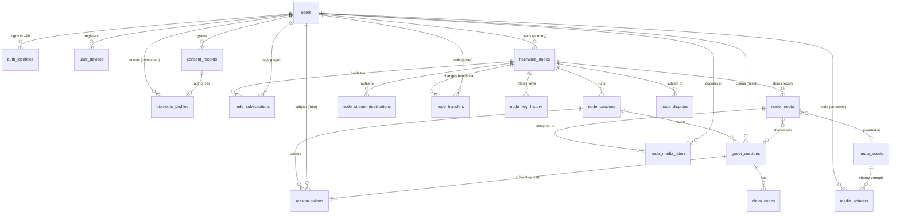

# Decoupled Identity Architecture — Technical API Proposal (v2)

**Status: proposal only.** Nothing in this document is built, deployed, or
wired into the Flutter client. It is the contract for Binnacle Cloud, the
Vision unit (Jetson Orin Nano) software, and Connect to review and build
against.

**Supersedes:**
- v1 of this file (single email/password account API on Core, with biometric
  unlock).
- The interim "Core-issued per-boat member accounts" idea, rejected on
  2026-09-18 because a boat-siloed account stops a rider carrying their profile
  to other boats.

**Revision v2.1 (2026-09-18):** adds the cellular-dead-zone operating
envelope (4.9), a stronger Guest-to-Global claim code (6.2), and the boat-sale
protocol with cryptographic factory reset (7.1-7.2), with matching schema, API,
threat, decision and test entries.

**Revision v2.2 (2026-09-18):** records the owner's decisions (section 11.1) and
applies their consequences: bought identity provider with a Binnacle token
service (5.0), co-owned media via deduplicated pointers (2.2-2.3), tier
governance and trials (2.4), ownership disputes and stolen units (7.3), age
gates (8). Open items are in section 11.2.

**Related issues:** BIN-46 (security/account linking/authorization), BIN-40
(Binnacle Live privacy/viewing), BIN-41 (cloud media/Library), BIN-48
(S3/CloudFront), BIN-43 (subscriptions/entitlements), BIN-39 (live uplink).

**Standing constraints carried into this design**
- No biometric *authentication*. Face/physique embeddings (section 8) are
  used for rider *recognition* by Spotter, never to sign a user in or unlock
  anything.
- No credentials, stream keys, or tokens in code, logs, screenshots, or
  evidence. All examples below use placeholders.
- Broadcast control stays separate from vessel control (BIN-46).

---

## 1. Model at a glance

Three separate concerns that the earlier design fused together:

| Concern | Entity | Lives in | Lifetime |
|---|---|---|---|
| **Who is the human** | Rider Account (`users`) | Binnacle Cloud | Permanent, global, follows the rider to any boat |
| **What is the boat gear** | Vision unit (`hardware_nodes`) | Cloud registry + the unit itself | Permanent, owned by one primary Rider Account |
| **Who may do what right now** | Session access (`session_tokens`) | Issued by the Vision unit, mirrored to Cloud | Ephemeral, tied to one ride session, not to the hardware |

```
  Rider Account (global)                    Vision unit (host)
  ┌───────────────────────┐                ┌────────────────────────────┐
  │ OAuth identities      │                │ owner_user_id ─────────────┼─► Rider Account
  │ media library (cloud) │                │ subscription tier          │
  │ billing state (payer) │                │ NVMe storage registry      │
  │ Spotter embeddings*   │                │ stream routing (server-    │
  └──────────┬────────────┘                │   side secret refs)        │
             │ cached Rider Identity       └─────────────┬──────────────┘
             │ Assertion (JWT, offline)                  │
             ▼                                           │ local Wi-Fi
       Phone (Connect) ── mDNS / QR handshake ───────────┘
             ▲                                           │
             └────── Crew Session Token (temporary) ◄────┘
       Guest (no app) ── captive portal ─► Guest Session ID + Claim Code
```
\* Only with separate, explicit biometric consent (section 8).

---

## 2. Entities and database schema

PostgreSQL in Binnacle Cloud is the system of record. The Vision unit keeps a
local replica (SQLite) of the tables it needs to operate offline; the
replication rules are in section 4.7.

### 2.1 Relationships



### 2.2 DDL (Postgres; abridged to what the relationships need)

```sql
-- ── Rider Account (the User) ───────────────────────────────────────────
CREATE TABLE users (
  user_id        UUID PRIMARY KEY DEFAULT gen_random_uuid(),
  display_name   TEXT NOT NULL,
  primary_email  CITEXT,                       -- nullable: Apple private relay may hide it
  status         TEXT NOT NULL DEFAULT 'active'
                 CHECK (status IN ('active','suspended','pending_deletion')),
  birth_date     DATE NOT NULL,                -- collected once at sign-up; used only for the 13+/18+ gates
  billing_ref    TEXT,                         -- opaque payment-processor customer id (payer state)
  created_at     TIMESTAMPTZ NOT NULL DEFAULT now(),
  deleted_at     TIMESTAMPTZ
);

CREATE TABLE auth_identities (
  identity_id       UUID PRIMARY KEY DEFAULT gen_random_uuid(),
  user_id           UUID NOT NULL REFERENCES users ON DELETE CASCADE,
  provider          TEXT NOT NULL CHECK (provider IN ('apple','google','email_otp')),
  provider_subject  TEXT NOT NULL,             -- OIDC `sub`, or normalized email for email_otp
  email             CITEXT,
  email_verified    BOOLEAN NOT NULL DEFAULT false,
  created_at        TIMESTAMPTZ NOT NULL DEFAULT now(),
  UNIQUE (provider, provider_subject)
);

-- A phone's non-exportable key; used for proof-of-possession (section 4).
CREATE TABLE user_devices (
  device_id     UUID PRIMARY KEY DEFAULT gen_random_uuid(),
  user_id       UUID NOT NULL REFERENCES users ON DELETE CASCADE,
  jwk_thumbprint TEXT NOT NULL UNIQUE,         -- RFC 7638 SHA-256 thumbprint of the public key
  public_jwk    JSONB NOT NULL,
  platform      TEXT NOT NULL,                 -- 'android' | 'ios'
  registered_at TIMESTAMPTZ NOT NULL DEFAULT now(),
  revoked_at    TIMESTAMPTZ
);

-- ── Vision hardware entity (the Host) ──────────────────────────────────
CREATE TABLE hardware_nodes (
  node_id          UUID PRIMARY KEY DEFAULT gen_random_uuid(),
  owner_user_id    UUID NOT NULL REFERENCES users,      -- primary owner
  serial           TEXT NOT NULL UNIQUE,
  model            TEXT NOT NULL DEFAULT 'vision-orin-nano',
  display_name     TEXT,                                -- NOT broadcast over mDNS
  node_public_jwk  JSONB NOT NULL,                      -- private key never leaves the unit
  node_key_id      TEXT NOT NULL,                       -- kid used in Crew Session Tokens
  join_policy      TEXT NOT NULL DEFAULT 'approve'
                   CHECK (join_policy IN ('approve','known_crew','open_to_riders')),
  attestation_public_jwk JSONB NOT NULL,                -- factory identity key; survives a factory reset
  ownership_epoch  INT NOT NULL DEFAULT 1,              -- +1 on every ownership change (section 7.2)
  status           TEXT NOT NULL DEFAULT 'active'
                   CHECK (status IN ('active','transfer_pending','released',
                                     'unprovisioned','decommissioned','stolen_blocked')),
  claimed_at       TIMESTAMPTZ NOT NULL DEFAULT now(),
  last_seen_at     TIMESTAMPTZ
);

-- Every node signing key ever used; a revoked key is rejected by all Cloud services.
CREATE TABLE node_key_history (
  node_id      UUID NOT NULL REFERENCES hardware_nodes,
  node_key_id  TEXT NOT NULL,
  public_jwk   JSONB NOT NULL,
  epoch        INT NOT NULL,
  created_at   TIMESTAMPTZ NOT NULL DEFAULT now(),
  revoked_at   TIMESTAMPTZ,
  PRIMARY KEY (node_id, node_key_id)
);

-- One row per sale / hand-over (section 7.2).
CREATE TABLE node_transfers (
  transfer_id        UUID PRIMARY KEY DEFAULT gen_random_uuid(),
  node_id            UUID NOT NULL REFERENCES hardware_nodes,
  seller_user_id     UUID NOT NULL REFERENCES users,
  buyer_user_id      UUID REFERENCES users,          -- set at completion
  state              TEXT NOT NULL DEFAULT 'initiated'
                     CHECK (state IN ('initiated','released','erased','completed','cancelled','expired')),
  transfer_code_hash BYTEA NOT NULL UNIQUE,          -- single use; plaintext shown once to the seller
  secrets_disposition TEXT NOT NULL DEFAULT 'rehome'
                     CHECK (secrets_disposition IN ('rehome','destroy')),
  erase_nonce        BYTEA NOT NULL,                 -- Cloud-issued; must appear in the erase attestation
  erase_attestation  JSONB,                          -- verified before 'erased'
  initiated_at       TIMESTAMPTZ NOT NULL DEFAULT now(),
  expires_at         TIMESTAMPTZ NOT NULL,           -- 7 days
  completed_at       TIMESTAMPTZ
);

-- Tier lives on the node; the payer is a Rider Account (reconciles rules 1 and 2).
CREATE TABLE node_subscriptions (
  subscription_id  UUID PRIMARY KEY DEFAULT gen_random_uuid(),
  node_id          UUID NOT NULL REFERENCES hardware_nodes,
  payer_user_id    UUID NOT NULL REFERENCES users,
  tier             TEXT NOT NULL CHECK (tier IN ('free','ride','creator','creator_plus')),
  source           TEXT NOT NULL CHECK (source IN ('purchase_trial','resale_trial','paid','comp')),
  starts_at        TIMESTAMPTZ NOT NULL,
  ends_at          TIMESTAMPTZ,
  UNIQUE (node_id) DEFERRABLE INITIALLY DEFERRED   -- one active row; history kept in audit_log
);

-- Provider keys are never stored here: only a pointer into the cloud secret store.
CREATE TABLE node_stream_destinations (
  destination_id UUID PRIMARY KEY DEFAULT gen_random_uuid(),
  node_id        UUID NOT NULL REFERENCES hardware_nodes ON DELETE CASCADE,
  provider       TEXT NOT NULL,                -- youtube|facebook|twitch|custom_rtmp|binnacle_live
  label          TEXT NOT NULL,
  secret_ref     TEXT NOT NULL,                -- e.g. secrets-manager ARN; never returned by any API
  status         TEXT NOT NULL DEFAULT 'active',
  created_at     TIMESTAMPTZ NOT NULL DEFAULT now()
);

-- ── Ride session, tokens, guests ───────────────────────────────────────
CREATE TABLE node_sessions (
  node_session_id UUID PRIMARY KEY,            -- generated by the unit (works offline)
  node_id         UUID NOT NULL REFERENCES hardware_nodes,
  ownership_epoch INT NOT NULL,                -- new owners never see earlier epochs
  started_by      UUID REFERENCES users,
  started_at      TIMESTAMPTZ NOT NULL,
  ended_at        TIMESTAMPTZ,
  synced_at       TIMESTAMPTZ
);

CREATE TABLE guest_sessions (
  guest_session_id UUID PRIMARY KEY,           -- 128-bit random, generated by the unit
  node_id          UUID NOT NULL REFERENCES hardware_nodes,
  node_session_id  UUID NOT NULL REFERENCES node_sessions,
  created_at       TIMESTAMPTZ NOT NULL,
  expires_at       TIMESTAMPTZ NOT NULL,       -- access window, e.g. session end + 24 h
  claimed_by       UUID REFERENCES users,
  claimed_at       TIMESTAMPTZ
);

CREATE TABLE session_tokens (
  token_id        UUID PRIMARY KEY,            -- the JWT `jti`
  node_session_id UUID NOT NULL REFERENCES node_sessions,
  node_id         UUID NOT NULL REFERENCES hardware_nodes,
  ownership_epoch INT NOT NULL,                -- tokens from an earlier epoch are void
  subject_type    TEXT NOT NULL CHECK (subject_type IN ('user','guest')),
  user_id         UUID REFERENCES users,
  guest_session_id UUID REFERENCES guest_sessions,
  role            TEXT NOT NULL CHECK (role IN ('host','crew','guest')),
  scopes          TEXT[] NOT NULL,
  device_thumbprint TEXT,                      -- `cnf.jkt` binding; NULL for portal guests
  join_method     TEXT NOT NULL CHECK (join_method IN ('mdns','qr','portal')),
  issued_at       TIMESTAMPTZ NOT NULL,
  expires_at      TIMESTAMPTZ NOT NULL,
  revoked_at      TIMESTAMPTZ,
  revoked_reason  TEXT,
  CHECK ((subject_type='user'  AND user_id IS NOT NULL AND guest_session_id IS NULL) OR
         (subject_type='guest' AND guest_session_id IS NOT NULL AND user_id IS NULL))
);
CREATE INDEX ON session_tokens (node_id, expires_at);

CREATE TABLE claim_codes (
  claim_id         UUID PRIMARY KEY DEFAULT gen_random_uuid(),
  guest_session_id UUID NOT NULL REFERENCES guest_sessions,
  local_code_hash  BYTEA NOT NULL,             -- short form, e.g. WAKE-842; boat Wi-Fi redemption only
  code_hash        BYTEA NOT NULL UNIQUE,      -- full form, e.g. WAKE-842-K7Q2M9; HMAC-SHA256(pepper, code)
                                               -- plaintext never stored
  expires_at       TIMESTAMPTZ NOT NULL,
  failed_attempts  SMALLINT NOT NULL DEFAULT 0,
  redeemed_at      TIMESTAMPTZ
);

-- ── Media ──────────────────────────────────────────────────────────────
-- Co-ownership via deduplicated pointers (owner decision 2026-09-18).
-- A clip is uploaded ONCE; each co-owner holds a pointer with their own retention.
-- Object store is provider-neutral here (see open item 11.2-2).
CREATE TABLE media_assets (
  media_asset_id   UUID PRIMARY KEY DEFAULT gen_random_uuid(),
  source_node_id   UUID REFERENCES hardware_nodes,
  sha256           BYTEA NOT NULL,             -- verified against the stored object
  object_key       TEXT NOT NULL,              -- keyed by asset id, never by user; private
  created_at       TIMESTAMPTZ NOT NULL DEFAULT now(),
  purge_after      TIMESTAMPTZ                 -- set when the last active pointer expires/deletes
);

CREATE TABLE media_pointers (
  pointer_id       UUID PRIMARY KEY DEFAULT gen_random_uuid(),
  media_asset_id   UUID NOT NULL REFERENCES media_assets,
  user_id          UUID NOT NULL REFERENCES users,
  role             TEXT NOT NULL CHECK (role IN ('uploader','co_owner')),
  retention_expires_at TIMESTAMPTZ NOT NULL,   -- from THIS user's own account tier
  created_via      TEXT NOT NULL CHECK (created_via IN ('host_assignment','recognition_confirmed','guest_claim')),
  created_at       TIMESTAMPTZ NOT NULL DEFAULT now(),
  deleted_at       TIMESTAMPTZ,
  UNIQUE (media_asset_id, user_id)
);

-- The unit's local NVMe registry (replicated to Cloud when online).
CREATE TABLE node_media (
  local_media_id   UUID PRIMARY KEY,
  node_id          UUID NOT NULL REFERENCES hardware_nodes,
  node_session_id  UUID NOT NULL REFERENCES node_sessions,
  sha256           BYTEA NOT NULL,
  size_bytes       BIGINT NOT NULL,
  kind             TEXT NOT NULL,              -- original | highlight | derivative
  shared_guest_session_id UUID REFERENCES guest_sessions,  -- set by the host, never inferred
  media_asset_id   UUID REFERENCES media_assets,           -- non-NULL only after verified upload
  created_at       TIMESTAMPTZ NOT NULL
);

-- A multi-rider clip has several assignees. Assignment is always explicit.
CREATE TABLE node_media_riders (
  local_media_id UUID NOT NULL REFERENCES node_media,
  user_id        UUID NOT NULL REFERENCES users,
  assigned_by    TEXT NOT NULL CHECK (assigned_by IN ('host','rider_confirmed_recognition','guest_claim')),
  assigned_at    TIMESTAMPTZ NOT NULL DEFAULT now(),
  PRIMARY KEY (local_media_id, user_id)
);

-- Ownership disputes and theft reports (section 7.3). Handled by Support only.
CREATE TABLE node_disputes (
  dispute_id     UUID PRIMARY KEY DEFAULT gen_random_uuid(),
  node_id        UUID NOT NULL REFERENCES hardware_nodes,
  claimant_user_id UUID NOT NULL REFERENCES users,
  state          TEXT NOT NULL DEFAULT 'open'
                 CHECK (state IN ('open','approved','rejected','withdrawn')),
  evidence_refs  TEXT[] NOT NULL,              -- pointers to encrypted evidence objects, not the files
  resolved_by    TEXT,                         -- Support staff id
  resolution     TEXT,
  opened_at      TIMESTAMPTZ NOT NULL DEFAULT now(),
  resolved_at    TIMESTAMPTZ
);

-- ── Consent and biometrics (section 8) ─────────────────────────────────
CREATE TABLE consent_records (
  consent_id     UUID PRIMARY KEY DEFAULT gen_random_uuid(),
  user_id        UUID NOT NULL REFERENCES users ON DELETE CASCADE,
  kind           TEXT NOT NULL,                -- 'biometric_recognition' | 'terms' | 'privacy' | ...
  policy_version TEXT NOT NULL,
  jurisdiction   TEXT,
  granted_at     TIMESTAMPTZ NOT NULL,
  revoked_at     TIMESTAMPTZ
);

CREATE TABLE biometric_profiles (
  profile_id     UUID PRIMARY KEY DEFAULT gen_random_uuid(),
  user_id        UUID NOT NULL REFERENCES users ON DELETE CASCADE,
  consent_id     UUID NOT NULL REFERENCES consent_records,   -- no consent row, no profile
  model_version  TEXT NOT NULL,
  embedding_enc  BYTEA NOT NULL,               -- envelope-encrypted; separate KMS key + IAM role
  created_at     TIMESTAMPTZ NOT NULL DEFAULT now(),
  destroy_by     TIMESTAMPTZ NOT NULL,         -- retention schedule enforced by a job
  destroyed_at   TIMESTAMPTZ
);

CREATE TABLE audit_log (
  audit_id   BIGSERIAL PRIMARY KEY,
  at         TIMESTAMPTZ NOT NULL DEFAULT now(),
  actor_type TEXT NOT NULL, actor_id TEXT,
  action     TEXT NOT NULL, subject TEXT,
  detail     JSONB                             -- tokens/keys are redacted before insert
);
```

### 2.3 Rules the schema encodes

- A user can exist with no node, and a node always has exactly one primary
  owner. Riders travelling to another boat need no relationship to that boat.
- `session_tokens` binds a subject to a `node_session_id`, not to a node
  forever. When the session ends, every token for it is revoked.
- **Tier vs billing.** Rule 1 puts billing state on the Rider Account; rule 2
  puts the active tier on the Vision unit. Both hold: the *payer* is a user
  (`node_subscriptions.payer_user_id`, `users.billing_ref`), the *entitlement*
  attaches to the node. Ownership transfer of a node re-points the
  subscription only if the payer agrees.
- Media has no single owner. `media_assets` is the stored object; each co-owner
  holds a `media_pointers` row. `source_node_id` is provenance.
  A guest's media reaches an account only through a claim (section 6).
- `node_media.media_asset_id` is non-NULL only after a checksum-verified
  upload, which is what lets Connect honestly label media "backed up".
- **Co-ownership.** A multi-rider clip is uploaded once (it is one file on the
  unit) and every assigned rider gets a pointer. The object is kept until
  **every** pointer's retention has expired or been deleted, then purged after a
  grace period. Removing a clip removes only the caller's pointer.
- **Pointers are never inferred.** They are created only by host assignment,
  by an enrolled adult rider confirming a recognition suggestion, or by a guest
  claim (6.3).

### 2.4 Tiers, trials and retention (owner-decided)

| Question | Rule |
|---|---|
| What the **Vision unit's** tier governs | Capture and processing capabilities and live streaming/fan-out (destinations, provider features) |
| What the **Rider Account's** tier governs | Long-term cloud retention of that rider's pointers (each pointer expires on its own owner's tier) |
| New unit, purchased new | One month of Creator+ (`purchase_trial`, BIN-43), starting at activation |
| Used unit, bought second-hand | **No** Creator+ trial. One 14-day basic **Ride** trial (`resale_trial`); Creator tiers must be paid for |
| Resale-trial eligibility | Only after a completed transfer or an approved dispute; once per node and buyer; never for the seller or any earlier owner of that node; no loops (A to B to A) |
| Co-owner with a longer retention | The object persists until the last pointer's retention ends; each rider's own tier decides only their own pointer |


---

## 3. Token types

| Token | Issuer | Verified by | Purpose | Default lifetime |
|---|---|---|---|---|
| **Access token** | Cloud | Cloud APIs | Call Cloud APIs | 15 min, refreshable |
| **Refresh token** | Cloud | Cloud | Renew the two below | 60 days, rotating, revocable |
| **Rider Identity Assertion (RIA)** | Cloud, ES256 | **The Vision unit, offline** | Prove "I am Rider X" without cellular | **14 days** (approved, 11.1) |
| **Crew Session Token (CST)** | **The Vision unit**, ES256 | The Vision unit | Temporary role for one ride session | Session length, hard cap 12 h |
| **Guest Session ID** | The Vision unit | The Vision unit | Identify a captive-portal guest | Session end + 24 h |
| **Claim Code** | The Vision unit | Node (short form) or Cloud (full form) | Later merge guest clips into an account | 30 days (owner decision) |

### 3.1 Rider Identity Assertion (the "locally cached JWT")

```
header: { "alg":"ES256", "kid":"<cloud signing key id>", "typ":"binnacle-ria+jwt" }
claims: {
  "iss":"https://id.binnacle.example",   "aud":"binnacle-vision",
  "sub":"user:<user_id>",                "name":"<display_name>",
  "iat":..., "nbf":..., "exp":...,       "jti":"<uuid>",
  "cnf":{ "jkt":"<phone key thumbprint>" },   // RFC 7800 / 7638 binding
  "ver":1
}
```
- Bound to the phone's non-exportable key (`cnf.jkt`). A copied token is
  useless without that key, which matters because the token must be usable
  offline for days.
- No tier, email, or embeddings in the token. Entitlements come from the
  node's own subscription record.
- Refreshed silently whenever the phone has internet. If it lapses while
  offline, the phone can still join as a **guest** (section 6), and will show
  "Sign-in expired — connect to the internet once to restore your profile".

---

## 4. Ephemeral session access: the offline handshake

### 4.1 Roles and scopes (RBAC tied to the session)

| Scope | host | crew | guest |
|---|:-:|:-:|:-:|
| `session.view` (live view, session status) | ✔ | ✔ | ✔ (view-only) |
| `highlight.trigger` (save highlight) | ✔ | ✔ | – |
| `library.read_session` (session clips) | ✔ | ✔ | shared clips only |
| `library.read_own` (clips assigned to me) | ✔ | ✔ | – |
| `broadcast.select_destination` | ✔ | optional per host | – |
| `broadcast.control` (start/stop) | ✔ | optional per host | – |
| `node.settings.write`, `node.manage_join_policy` | owner only | – | – |
| `session.end`, `token.revoke` | ✔ | – | – |
| `stream.read_key` | **nobody** | | |
| vessel/boat control | out of scope (separate control plane) | | |

`host` is granted automatically to the Rider Account equal to
`hardware_nodes.owner_user_id`, or by the owner delegating for that session.
Nothing a `crew` token can do persists after the session, and no scope
returns a stream key.

### 4.2 Two ways to start the handshake

| Mode | Discovery | Trust anchor | Use when |
|---|---|---|---|
| **A: dynamic QR (strongest)** | Host's screen (Spotter display or host phone) shows a QR that rotates every 60 s | QR carries the node key fingerprint + a one-time join nonce, so the joining phone pins the node and proves physical presence | Default for a new crew member |
| **B: mDNS + Wi-Fi passphrase** | Phone browses `_binnacle-vision._tcp.local.` on the boat's Wi-Fi | Wi-Fi passphrase (physical-presence proxy) + trust-on-first-use of the node key + host approval | Returning crew, convenience |

mDNS is unauthenticated multicast and can be spoofed, so it is used only for
discovery. Identity and trust come from the node key and the exchange below.

### 4.3 mDNS advertisement

```
service:   _binnacle-vision._tcp.local.        port 8443
instance:  Vision-<4 hex>                       (no serial, no boat name)
TXT:       v=1
           nid=<first 8 bytes of node_id, hex>
           fp=<first 8 bytes of SHA-256(node public key), hex>
           open=1|0                             (a ride session is open)
           cap=<capability flags>
```
No user, boat, or location data in TXT records. Platform notes: Android needs
`CHANGE_WIFI_MULTICAST_STATE` (multicast lock) or `NsdManager`; iOS needs
`NSLocalNetworkUsageDescription` and `NSBonjourServices` and shows a Local
Network permission prompt.

### 4.4 Handshake (no cellular required)

Preconditions: phone holds a valid RIA, its device key, and (Mode B) the boat
Wi-Fi passphrase. The unit holds a cached copy of Cloud's signing keys
(JWKS), a local revocation list, and its own node key.

```
Phone                                         Vision unit
  │  1. mDNS browse / scan QR                    │
  │ ◄──────── nid, fp, open ─────────────────────│
  │  2. TLS 1.3 to https://<host>:8443           │  (self-signed cert)
  │     check SHA-256(cert public key) == fp     │  → mismatch: abort, warn "unrecognised device"
  │                                              │
  │  3. POST /v1/join/hello                      │
  │     { client_nonce, device_public_jwk,       │
  │       join_nonce? (Mode A) }                 │
  │ ◄──── { node_nonce, node_id, node_time } ────│
  │                                              │
  │  4. POST /v1/join/prove                      │
  │     { ria,                                   │
  │       pop: JWS_device_key(                   │
  │         node_nonce, client_nonce, node_id,   │
  │         TLS-exporter(RFC 8446 §7.5)) }       │  ← channel binding defeats relay/replay
  │                                              │
  │              5. verify: ria signature (cached JWKS by kid), iss, aud,
  │                 nbf/exp (±5 min skew), jti ∉ revocation list,
  │                 cnf.jkt == thumbprint(device_public_jwk), pop signature,
  │                 nonces fresh and single-use, node clock sane (section 4.6),
  │                 user ∉ node ban list
  │              6. role: user_id == owner_user_id → host;
  │                 else per join_policy:
  │                   approve        → wait for host approval on host device/Spotter
  │                   known_crew     → allow if user_id ∈ node's allowlist
  │                   open_to_riders → allow any valid Rider Account
  │              7. mint CST (ES256, signed with the node key), record in local session_tokens
  │ ◄──── { cst, role, scopes, expires_at } ─────│
  │  8. WSS control channel: Authorization: CST + PoP per connection
```

CST claims:
```
{ "iss":"node:<node_id>", "sub":"user:<user_id>", "nsid":"<node_session_id>",
  "role":"crew", "scopes":[...], "cnf":{"jkt":"<phone key thumbprint>"},
  "iat":..., "exp":..., "jti":"<uuid>", "kid":"<node_key_id>" }
```

### 4.5 Renewal, end, and revocation

- `POST /v1/session/refresh` extends a CST in slices (e.g. 2 h) while the
  node session is open, never beyond the 12 h cap or the session end.
- `POST /v1/session/end` (host) closes the node session and revokes all its
  tokens. A node reboot does not end tokens; a factory reset does.
- The host can revoke a single crew member at any time. The revocation is
  applied locally at once and to Cloud when next online.
- Every token check reads the local `session_tokens` row, so revocation works
  offline.

### 4.6 Clock and freshness offline

The Jetson may have no trustworthy time offline. The unit therefore keeps a
monotonic "last-known-good time" (GPS time when available, otherwise
Cloud-synced), and **refuses** to validate expiry if its clock is earlier than
that value (rollback). The phone's `node_time` exchange is advisory only.
Failure mode: rejects with `clock_untrusted`, and the host can reset time from
their authenticated phone.

### 4.7 Sync and what the unit caches

| Direction | Data | When |
|---|---|---|
| Cloud → unit | JWKS (with key overlap during rotation), revocation list (jti + disabled `user_id`s), subscription tier, destination metadata (never keys) | Whenever online; also signed bundle at manufacture |
| Unit → Cloud | `node_sessions`, `session_tokens` (incl. revocations), `guest_sessions`, `claim_codes` (hashes), `node_media` registry, audit events | Whenever online |

Accepted risk, stated plainly: an account disabled while a unit is offline
stays admitted until that unit syncs, bounded by the RIA lifetime (14 days
proposed) and the CST cap (12 h). Shorter RIA lifetimes trade this off against
offline usability.

### 4.8 Relationship to the existing device pairing

Today `PairingService` creates an EC keypair + CSR and binds a phone to one
boat's Core permanently, with a device credential in Keychain/Keystore. Under
this design:

- **Owner claim** replaces first pairing: on first setup the owner signs in,
  scans the unit's provisioning QR, and the unit registers with Cloud as a
  `hardware_nodes` row owned by that Rider Account (`POST /v1/nodes/claim`).
- **Crew access** uses the handshake above. Nothing permanent is stored about a
  crew member on the unit except the audit trail and (optional) allowlist.
- The existing pairing credential keeps working during a migration window, then
  is retired. This changes a security-critical existing protocol and needs
  Core-team review before any code.

### 4.9 Operating in a cellular dead zone

OAuth needs the internet, so it is deliberately kept off the water. Identity is
established at home, cached as a phone-bound signed token, and *verified* on the
lake with no cloud call.

**What works with zero cellular**

| Capability | How |
|---|---|
| A signed-in rider joins any Binnacle boat | Cached RIA + device key (sections 3.1, 4.4) |
| Roles, scopes, approval, revocation of crew | Unit-issued CSTs; local revocation list |
| Guest joins, gets a Guest Session ID and Claim Code | Captive portal on the unit (section 6) |
| Guest redeems a short code on the boat's Wi-Fi | Unit-local (6.2) |
| Recording, highlight save, local NVMe registry | Unit-local |

**What needs connectivity (and what the rider sees instead)**

| Needs internet | Offline behaviour |
|---|---|
| First sign-in / creating an account | Not possible on the lake. Rider joins as **guest** and claims clips later (Guest-to-Global) |
| Refreshing the cached identity | Silent, whenever the app is open with internet; rolling 14-day window |
| Fresh revocation / key rotation | Courier bundles below, else next unit sync |
| Cloud upload, remote viewers, external live destinations | Queued/unavailable; state shown truthfully |
| Cloud-side claim redemption | Use the local short code on the boat, or wait for signal |

**Cache lifecycle (phone)**
- The RIA and device key live in secure storage. The rider is told before the
  trip: "Offline sign-in valid until <date>". Under 3 days left, Connect
  prompts "Open the app once with internet before your trip".
- Expired token with no signal: the join falls back to guest, with a banner
  "Sign-in expired — connect to the internet once to restore your profile".
- A new phone, reinstall or wiped app loses the device key, so the rider must
  sign in online once. This is stated in the UI.

**Keeping the unit's trust data fresh when the unit itself is offline for
weeks.** Phones sync with Cloud far more often than a boat's unit does, so
phones act as couriers:
- Cloud publishes a **signed key-set bundle** (current + next signing keys,
  monotonic version, expiry) and a **signed revocation bundle**, both signed by
  a long-lived root key whose public half is pinned in the unit's firmware.
- During the handshake, the phone offers any bundle newer than the unit's
  (`POST /v1/join/bundles`). The unit accepts only strictly higher versions
  that verify against the pinned root key (rollback-proof).
- Rotation rule: a new signing key is published at least 30 days before it is
  first used, and the old key stays valid until every RIA it signed has expired.

**Proving test (mandatory):** phone and unit both in airplane mode with only
the boat Wi-Fi up: a rider whose account has never touched that boat joins as
crew; a guest joins and redeems a short code; a crew member revoked by the host
is refused on reconnect; an RIA older than 14 days is refused and the rider is
offered guest access.


---

## 5. Cloud API (for the Connect app and the unit)

Authentication: OAuth 2.0 for native apps (RFC 8252) with PKCE (RFC 7636).
Apple and Google via OIDC. "Email" is **passwordless email one-time code**
(there is no password to store or leak). If any third-party sign-in is
offered, current App Store rules require a privacy-preserving equivalent;
Sign in with Apple satisfies this. Verify the current guideline at build time.

### 5.0 Identity provider (bought) and the Binnacle token service

**Decision (owner, 2026-09-18): buy, do not build credential handling.** Use
AWS Cognito or Supabase Auth (which one is open, section 11.2) for Apple and
Google sign-in, passwordless email code, account recovery, session/refresh and
abuse controls. Binnacle stores no passwords and no sign-in provider tokens.

**Design consequence you should know about.** The offline Rider Identity
Assertion (RIA, 3.1) has to be valid for 14 days, bound to the phone's key,
and verifiable by a unit against a key set that Binnacle pins and rotates on
its own schedule (4.9). Managed-IdP tokens generally do not meet all three:
their access/ID token lifetimes are far shorter than 14 days (verify the
current limits of the chosen product) and their signing keys and claims are
under the vendor's control, so a unit could not pin them. Therefore:

- The **IdP authenticates the human.**
- A small **Binnacle token service** (ES256 key in KMS, chained to the
  firmware-pinned root, 4.9) exchanges a valid IdP session plus proof of the
  phone's device key for the RIA (`POST /v1/identity/token`).
- This is token exchange, not custom authentication: the service never sees or
  verifies a credential.

`auth_identities` mirrors the IdP's subject and provider; `users` is
Binnacle's own profile row. Account deletion must delete in both places.

### 5.1 Identity

| Method & path | Purpose |
|---|---|
| Sign-in itself (Apple, Google, email code) | Runs in the bought IdP's SDK/hosted flow, not in Binnacle APIs. Under-13 sign-up is refused (8.7). |
| `POST /v1/identity/token` | `{idp_session, device_proof}` -> Binnacle access token and RIA. Creates the `users` row on first use. |
| `POST /v1/auth/refresh` | Rotate refresh token; returns new access token and RIA. |
| `POST /v1/auth/logout` | Revoke refresh token and the device's RIAs. |
| `POST /v1/users/me/identities` | Link another provider. Only after re-authentication; never auto-link on email match alone. |
| `DELETE /v1/users/me` | Account deletion (in-app path required by the app stores). Cascades: identities, devices, biometric profiles destroyed, media per retention policy; nodes must first be transferred or decommissioned. |
| `POST /v1/devices` | Register the phone's public key (proof-of-possession). |
| `GET /.well-known/jwks.json` | Public signing keys (units cache this). |

### 5.2 Nodes (owner-facing)

| Method & path | Purpose |
|---|---|
| `POST /v1/nodes/claim` | Owner binds a unit to their account using the provisioning code + the unit's signed statement. |
| `GET /v1/nodes`, `GET /v1/nodes/{id}` | Nodes the caller owns. |
| `PATCH /v1/nodes/{id}` | Name, `join_policy`, allowlist. |
| `POST /v1/nodes/{id}/transfer` | Seller starts a sale (needs step-up re-authentication within 5 min). Returns `transfer_id`, one-time `transfer_code`, expiry. Body: `{secrets_disposition: rehome\|destroy}`. Immediately revokes all session tokens for the node and stops issuing it any credentials. |
| `POST /v1/nodes/{id}/transfer/release` | Cloud detaches the node: destination secrets re-homed to the seller (or destroyed), subscription ended or re-pointed, node key revoked. |
| `POST /v1/nodes/{id}/transfer/cancel` | Allowed only before `erased`; restores the seller's control. |
| `POST /v1/nodes/{id}/erase-attestation` | Unit (or a courier phone) submits the signed erase attestation (7.2 step 4f). |
| `POST /v1/nodes/{id}/transfer/complete` | Buyer completes with `transfer_code` + provisioning QR data; requires a verified attestation. |
| `POST /v1/nodes/{id}/deauthorize` | Seller cuts the node off from Cloud without the unit (lost, stolen, unreachable). Does **not** erase footage on the unit. |
| `POST /v1/nodes/{id}/destinations` | Create a stream destination; the secret goes straight into the cloud secret store and is never returned. |
| `GET /v1/nodes/{id}/sync` | Unit-facing: JWKS, revocations, tier (authenticated with the node key). |

### 5.3 Unit-local API (over the boat Wi-Fi, section 4)

`/v1/join/hello`, `/v1/join/prove`, `/v1/session/refresh`,
`/v1/session/end`, `/v1/session/revoke`, `/v1/join/bundles`,
`/v1/guest/portal` (HTTP), `/v1/guest/claim-code`, `/v1/guest/clips`,
`/v1/admin/backup-status` (host), `/v1/admin/factory-reset` (host + physical
confirmation, section 7.2).

### 5.4 Media and entitlements

Media upload authorization, short-lived playback URLs, and retention follow
BIN-41/BIN-48/BIN-46 and use the Rider Account as the subject. Tier governance is
decided in 2.4: the rider's tier governs retention of their own pointers.

---

## 6. Guest-to-Global pipeline

### 6.1 Guest joins without the app

1. Boat Wi-Fi's captive portal (DNS/HTTP redirect on the unit; the RFC 8908 /
   DHCP option 114 Captive Portal API where the phone OS supports it)
   presents a page: privacy notice, terms, "Continue as guest".
2. The unit creates a `guest_sessions` row: a 128-bit random
   `guest_session_id`, expiry = node session end + 24 h, and sets it in an
   HttpOnly cookie. Role `guest`, scopes: view-only + shared clips.
3. Guests see and download **only clips the host has shared with them**
   (`node_media.shared_guest_session_id`). Nothing is attributed to a guest
   automatically: no face/physique recognition is ever run on guests, and no
   embeddings are created for them.
4. The portal warns that in-OS captive-portal browsers often cannot download
   files and offers "Open in browser".

### 6.2 Claim Code

The unit generates a code per guest session and shows it **only** on that
guest's own portal page, never on the Spotter display or any shared screen. It
comes in two forms so the friendly one stays safe:

| Form | Example | Where it works | Why it is safe |
|---|---|---|---|
| **Short (local)** | `WAKE-842` | Only while the phone is on that boat's Wi-Fi, redeemed against the unit itself | Scoped to one unit and one guest session; requires physical presence on the boat network; the unit rate-limits (5 attempts/min per device), locks a code after 5 misses, and notifies the host after 10 failures |
| **Full (remote)** | `WAKE-842-K7Q2M9` | Anywhere, redeemed against Cloud | 3 digits + 6 Crockford Base32 characters, about 40 bits, hashed at rest (HMAC-SHA256 with a server pepper), never stored in plaintext |

Why not the short form alone for remote use: `WAKE-842` has only 1,000
possibilities. Cloud has no proximity signal, so an attacker who can try codes
from anywhere would eventually collide with some live guest's code. The 3-digit
form is fine on the boat, not on the internet.

Common rules:
- Single use; 30-day expiry (host-configurable 7-90 days).
- Cloud redemption: 5 failed attempts locks that code; 10 per account per
  hour; per-IP and global throttles; verified account required; generic error
  text; alert on abnormal redemption rates.
- Every downloaded clip carries a manifest (`guest_session_id`, `sha256`) so
  the app can match local files to server records without re-uploading.

### 6.3 Redeeming (after the guest installs the app)

```
App (signed-in Rider Account)                      Cloud
  POST /v1/claims/redeem { claim_code }
                                                   look up code_hash; check expiry/attempts;
                                                   if the unit has not synced yet → 202 "pending, retry"
  ◄── { guest_session_id, clips:[{sha256,size,...}] }
  App compares sha256 with files already on the phone:
    – matches are linked, not duplicated
    – missing ones are offered for download/import
  Cloud: guest_sessions.claimed_by = user, media rights recorded;
         media reaches the library only after checksum-verified upload.
```
If the phone is on that boat's Wi-Fi it can redeem the **short** code directly
against the unit (`/v1/guest/claim-code`), which works with no Cloud
reachability; the unit records the claim and syncs it to Cloud later. Remote
redemption uses the **full** code.

A clip can contain several people. Under the co-ownership decision (2.3), a
successful claim gives the guest a **pointer** to the shared clip (no second
upload); the host and any other co-owner keep theirs. Erasure/takedown of
co-owned clips is open item 11.2-3.

---

## 7. Stream routing, secrets, and hardware transfer (BIN-46 alignment)

- Provider keys and OAuth tokens live only in the cloud secret store,
  referenced by `node_stream_destinations.secret_ref`.
- When a broadcast starts, the unit requests a short-lived, scoped ingest
  credential from Cloud (or Cloudflare Stream live input). Phones never
  receive stream keys; crew can pick a destination by label but cannot read
  the secret.
- The current Connect behaviour (custom RTMP entered on the phone, kept only
  in memory) would migrate to `POST /v1/nodes/{id}/destinations`.
- Logs, audit rows, and evidence redact tokens, keys, and sensitive URLs.

### 7.1 Invariant: the unit holds no long-lived cloud credentials

This is what makes a boat sale safe, so it is a design rule, not a convention.

- **Media is private and reachable only through a rider's pointer, never
  through a unit.** Objects are keyed by asset id in a private store; there is
  no node-owned bucket and no public URL.
- The unit has **no** standing storage credentials and no role with list/read
  on any bucket. To upload, it asks Cloud for a **single-object, short-lived
  (<= 15 min) upload credential** scoped to that one asset key, with the
  expected size and checksum enforced (BIN-48). It can write one named object;
  it cannot read or list anything.
- Provider OAuth tokens and stream keys live in the cloud secret store,
  referenced from `node_stream_destinations`; they belong to the account that
  created them.
- Consequence: a buyer holding the hardware, even before any reset, has no path
  to the seller's storage buckets, library or provider accounts. The reset
  below protects what is *on the unit*; this invariant protects what is *in
  the cloud*.

### 7.2 Boat sale: transfer and cryptographic factory reset

**State machine:** `active` -> `transfer_pending` (initiated) -> `released` ->
(unit erased) -> `unprovisioned` -> buyer claims -> `active` with
`ownership_epoch + 1`. The seller can cancel until the unit has been erased.
Erase cannot be undone.

**Hardware prerequisite (owner-confirmed 2026-09-18, not independently
verified by the author of this document):** Secure Boot; OP-TEE-backed disk
encryption with the key-encryption key (KEK) sealed in the SoC; programmable
fuses holding the factory identity key; and NVMe Sanitize on the M.2 drives.
The proving tests in section 12 must still show this works on the exact drive
and module SKUs shipped (raw-block carving after erase).

```
Seller (app)         Cloud                       Vision unit                Buyer (app)
 1 start transfer ─► step-up re-auth
                     transfer_pending; revoke all tokens;
                     no credentials issued to node;
                     transfer_code (one time) ──► shown to seller ─────────► (handed over)
 2 release ────────► detach destination secrets (rehome|destroy);
                     end/re-point subscription; revoke node key;
                     state = released
 3                                               backup gate: "412 clips: 380 confirmed
                                                 in cloud, 32 NOT backed up" -> export,
                                                 upload, or accept loss; typed "ERASE"
 4 physical confirm on the unit ─────────────►   cryptographic erase (below)
                     ◄──── erase attestation ────
                     verify chain + nonce; state = erased -> unprovisioned
 5                                               shows provisioning QR (new key fingerprint)
                     ◄─── transfer/complete ─────────────────────────────── scan QR + transfer_code
                     owner = buyer; epoch+1; new node key active
```

**Step 4 in detail (idempotent, resumable):**
1. Write an `erase_in_progress` flag first; stop capture, streaming, and the
   node API. On any reboot the unit refuses service until erase completes.
2. Zeroize the node private key, session-token store, cached identity tokens,
   in-memory embeddings, guest sessions, claim-code hashes, allowlists, Wi-Fi
   passphrase, and the local database.
3. **Destroy the KEK** in secure storage. The volume's data-encryption key can
   no longer be unwrapped, so every media file is unrecoverable at once
   (cryptographic erase).
4. Issue an NVMe sanitize / crypto-erase as a second layer, then verify by
   reading raw blocks: no valid filesystem header and no decryptable structure.
5. Generate a fresh node keypair in secure storage (new `node_key_id`), bump
   the local epoch, boot to `unprovisioned`.
6. Produce the **erase attestation**: a JWS signed by the factory identity key
   (`attestation_public_jwk`, chained to a Binnacle manufacturing CA) over
   `{node_id, transfer_id, erase_nonce (from Cloud), destroyed old_key_id,
   new_public_jwk, firmware measurement, time}`. If offline, it is stored and
   delivered later, or carried by the buyer's phone during claim.

**Buyer claim:** Cloud checks the attestation chain, that the nonce matches this
transfer, that the transfer is `released`, and that the attested new key equals
the one in the provisioning QR. Only then does ownership move. The buyer sees an
empty unit: earlier epochs' sessions, media registry and guest data are
invisible (epoch filter) and were cryptographically erased on the device.

**The seller's cloud data is untouched:** the seller's media pointers stay in
their library (`source_node_id` provenance remains but the buyer cannot resolve it),
provider accounts stay linked to the seller, and nothing about the seller's
storage was ever reachable from the unit (7.1).

**Failure and edge cases**

| Case | Behaviour |
|---|---|
| Seller cannot reach the unit (lost, dead, sold without reset) | `deauthorize` cuts the node off from Cloud (steps 1-2). The UI states plainly: footage still on the unit is **not** erased until the unit itself is reset. |
| Buyer has the unit; seller never released it | A physical recovery-mode reset wipes local data (protects the seller) but does **not** grant cloud ownership; Cloud still shows the seller. The buyer opens a Support dispute (7.3). |
| Stolen unit | Owner reports it stolen (7.3): the unit is permanently blocked from cloud services. A thief can wipe it but cannot claim it. |
| Power loss mid-erase | Flag-driven resume; no attestation is issued until every step completes. |
| Transfer never completed | Expires after 7 days; the seller can cancel any time before the erase. Rehomed secrets return to the seller's account. |
| Replay or theft of the transfer code | Single use, bound to `transfer_id` and the attested new key, 7-day expiry, hashed at rest. |
| Forged erase attestation | Rejected: signature must chain to the manufacturing CA and carry Cloud's `erase_nonce`. |
| Subscription | Ends with release, or re-points if the payer agrees. A used-unit buyer gets the 14-day Ride trial only, never the Creator+ purchase trial (2.4). |

### 7.3 Ownership disputes and stolen units (owner-decided 2026-09-18)

**Disputes** are settled by Binnacle Support through a manual ticket; there is
no self-service path. The claimant must provide:

1. A photo of the unit's physical **serial-number plate next to a handwritten
   note** showing the current date and the claimant's account email.
2. A **bill of sale or transaction receipt.**

Support compares the serial with the record, decides, and records the outcome
in `node_disputes`. Approval does **not** bypass the erase: the claimant must
still reset the unit (a physical recovery reset produces the erase
attestation), after which Support authorises `transfer/complete`. The resulting
subscription is the used-unit trial in 2.4.

**Stolen units.** Only the owner of record can report a unit stolen. The
report sets `stolen_blocked`: the node key and the factory attestation key are
blocklisted by serial, every credential request is refused, the unit cannot be
claimed or transferred, and its subscription is suspended. **This is permanent,
as decided; a dispute ticket cannot lift it.**

**Evidence handling.** Serial-plate photos and receipts are personal data:
encrypted at rest, visible only to Support, referenced (not embedded) in
`node_disputes`, and deleted a set period after resolution (period to be set,
11.2).

**Risks recorded for the owner (the decision above is implemented as stated):**
- A seller who never used the in-app transfer (an informal sale) could report
  the unit stolen and permanently brick the buyer's unit. The transfer flow
  removes this because the seller ceases to be the owner of record; the UI
  should warn buyers who accept a unit without a completed transfer.
- A mistaken report has no reversal at all. I recommend an audited,
  Support-only exception requiring a police report and two-person approval; it
  is not designed in unless you approve it.

---

## 8. Spotter embeddings: biometric data requirements

Rule 1 places facial/physique embeddings on the Rider Account. These are
biometric identifiers under laws such as Illinois BIPA, Texas CUBI, GDPR
Art. 9 (special-category data), and state privacy statutes. The design
therefore treats them as a separate, opt-in feature, not part of account
creation.

1. **Separate explicit consent.** No account-creation or OAuth step may
   create an embedding. A `consent_records` row of kind
   `biometric_recognition`, with policy version and jurisdiction, is a hard
   foreign-key prerequisite for any `biometric_profiles` row. Consent is
   revocable at any time.
2. **Recognition, not authentication.** Embeddings are never used to sign in,
   unlock, or authorize anything.
3. **Only enrolled, consenting riders.** No embeddings for guests, bystanders,
   or anyone who has not enrolled. Spotter cannot attribute clips to
   non-enrolled people.
4. **Per-ride opt-in to the boat.** An embedding reaches a Vision unit only
   if the rider allows "this boat may recognise me for this ride" at
   handshake. It is held encrypted in the unit's memory/session store and
   purged at session end. Unit owners cannot read or export it.
5. **Storage and access.** Envelope-encrypted with a dedicated KMS key and
   IAM role, separate from the media and account stores; every access is
   audited.
6. **Retention and deletion.** A written retention/destruction schedule
   (`destroy_by`) enforced by a job; deletion on request and on account
   deletion, with a deadline set by counsel.
7. **Age (owner-decided).** Standard accounts require age 13 or older (an
   under-13 sign-up is refused at a neutral age screen and no data is
   collected). Biometric enrolment requires age 18 or older, checked from the
   birth date collected at sign-up; a rider may opt in on turning 18.
   Consequence: riders under 18 are never recognised by Spotter, so their clips
   are assigned manually by the host. 13 is the COPPA threshold; other regimes
   (for example national ages of digital consent up to 16 under GDPR, and some
   US state laws) may add requirements, so counsel should review before launch
   outside the US.
8. **Recognition is a suggestion.** A recognition hit proposes a rider for a
   clip; assignment to the account requires the rider's or host's
   confirmation.
9. **Legal review before any build.** This section is a requirements list, not
   legal advice. The repo already carries `Rider.biometricConsent` and a
   BIPA-scoped consent reference; those must be reconciled with this design.

---

## 9. Threats and mitigations

| Threat | Mitigation |
|---|---|
| Stolen phone / copied RIA replayed | RIA and CST bound to the phone's non-exportable key (`cnf.jkt`) with proof-of-possession on every use |
| Evil-twin Wi-Fi or rogue "Vision" | TLS key pinned via QR fingerprint (Mode A) or TOFU + host approval (Mode B); fingerprint mismatch aborts |
| Relay of a handshake | TLS-exporter channel binding, single-use nonces, 30 s validity |
| mDNS spoofing / snooping | mDNS used for discovery only; TXT holds no identifiers beyond an 8-byte node prefix |
| Revoked user still admitted offline | Bounded by RIA lifetime and CST cap; local revocation list; documented trade-off |
| Clock rollback to extend tokens | Monotonic last-known-good time; reject on regression |
| Claim-code brute force / shoulder surfing | ~50-bit code, hashed, rate-limited, single use, shown only on the guest's own session |
| Account takeover via email collision | No auto-link on matching email; re-auth required to link identities |
| Malicious crew abusing scopes | Least-privilege scopes; no scope reads keys; host can revoke instantly |
| Node theft / resale | Owner-initiated transfer rotates node key and revokes all tokens; decommission wipes registry |
| Secrets in logs | Redaction before audit insert; CI static check for key/token patterns (existing audit) |
| Local-network exposure | Node API listens only on the boat network interface; TLS 1.3 only; rate-limited |
| Boat buyer reaches seller's cloud storage | Unit holds no standing storage credentials; media is reachable only through rider pointers; single-object short-lived upload credentials only (7.1) |
| Buyer recovers seller footage from the NVMe | KEK destruction + NVMe sanitize + raw-block verification (7.2 step 4) |
| Forged or replayed erase attestation / transfer code | Attestation chained to manufacturing CA with Cloud nonce; transfer code single-use and bound |
| Thief wipes and re-registers a stolen unit | Local wipe never grants cloud ownership; only the owner's release does |
| Short claim code guessed from the internet | Short form redeemable only on the boat's Wi-Fi; remote form is ~40 bits, hashed, throttled (6.2) |
| Unit offline for weeks misses a key rotation or revocation | Signed bundles couriered by phones, pinned root key, monotonic versions, 30-day key pre-publication (4.9) |

---

## 10. Connect (Flutter) impact

| Piece | Change |
|---|---|
| Sign-in | Sign-in through the bought IdP's SDK (Apple/Google/email code); RIA in secure storage; device key in Keystore/Secure Enclave (no `local_auth`) |
| Connection | Replace the permanent-pairing screen with Join Boat (QR or nearby boats via mDNS); `PairingService` kept behind a compatibility flag during migration |
| Session state | New `CrewSession` (CST, role, scopes) driving what each screen shows; UI gates are convenience, the unit enforces |
| Library | Media owned by the Rider Account; guest claim flow; "backed up" only after verified upload (already the rule) |
| Storage screen | Unchanged rule: never labels media remote without a confirmed object |
| Removed | The v1 "biometric unlock of a stored session" idea |

None of this is implemented in this change.

---

## 11. Decisions log and open items

### 11.1 Decided (owner, 2026-09-18)

| # | Decision | Reflected in |
|---|---|---|
| 1 | **Claim code:** two forms, `WAKE-842` (boat Wi-Fi only) and `WAKE-842-K7Q2M9` (cloud) | 6.2, `claim_codes` |
| 2 | **Resale trial:** no Creator+ trial for used units; 14-day Ride trial; Creator tiers paid | 2.4, `resale_trial` |
| 3 | **Disputes:** Support manual ticket with serial-plate photo + handwritten note (date + buyer email) + bill of sale/receipt. Stolen units permanently blocked from cloud | 7.3, `node_disputes`, `stolen_blocked` |
| 4 | **Offline keys:** publish a new signing key 30 days before first use, anchored by a firmware-pinned root key | 4.9 |
| 5 | **Hardware:** owner-confirmed Secure Boot, OP-TEE disk encryption, programmable fuses for the factory identity key, NVMe Sanitize | 7.2 |
| 6 | **Auth provider:** buy (AWS Cognito or Supabase Auth); no custom auth | 5.0 |
| 7 | **Offline token lifetime:** 14 days | 3, 3.1 |
| 8 | **Tier governance:** unit tier = capture/processing/live; rider tier = long-term cloud retention | 2.4 |
| 9 | **Clip ownership:** co-ownership through deduplicated pointers; one upload, file kept until all retention limits expire | 2.2, 2.3 |
| 10 | **Minimum age:** 13 for accounts; 18 for opt-in biometric Spotter embeddings | 2.2, 8 |

### 11.2 Still open

1. **Cognito or Supabase Auth?** The choice is still open. If AWS stays the
   durable-media store (BIN-48), Cognito fits IAM/STS-scoped upload credentials
   more directly; Supabase suits a non-AWS stack. Decide before Phase 1.
2. **Provider names conflict with the approved architecture.** Your note cites
   AWS IVS for streaming and Cloudflare R2 for clip storage. Approved
   Architecture v0.1 (BIN-39/BIN-48) says the opposite: Cloudflare Stream is the
   preferred live candidate and AWS S3 + CloudFront + MediaConvert the durable
   media candidate, and BIN-48 says replacing either needs a separate
   evidence-backed decision. This document stays provider-neutral. Are IVS/R2
   examples, or a change of direction? If a change, BIN-39, BIN-48 and the BIN-43
   cost model need updating first.
3. **Erasure and takedown for co-owned clips.** One co-owner deleting their
   pointer does not remove the clip for the other. A rider who wants a clip that
   shows them taken down needs a separate report/takedown path (and GDPR-style
   erasure handling); this needs BIN-40's moderation work.
4. **Does the unit owner (host) get a pointer** for every clip recorded on
   their unit, or only for clips they are in or assign to themselves?
5. **Stolen-flag reversal:** confirm "no reversal" or approve the audited
   Support-only exception (7.3).
6. **Age law beyond COPPA** (section 8.7), and the product effect that under-18
   riders are never auto-recognised.
7. **Proposals you have not yet ruled on:** default `join_policy` = `approve`;
   claim-code lifetime 30 days; per-ride opt-in for embeddings held in unit
   memory only (8.4); **legal review of section 8**, which is required before
   Phase 6.
8. **Retention period for dispute evidence** (suggest 90 days after resolution).

---

## 12. Delivery plan and proving tests

| Phase | Deliverable | Proving test |
|---|---|---|
| 0 | Resolve the open items in section 11.2; Core-team review of section 4.8 | Written sign-off |
| 1 | Cloud identity: bought IdP integration, Binnacle token service minting RIAs, `users`, devices, JWKS, refresh, delete account | Two providers create one account with no duplicate; deleted account cannot sign in (in the IdP and in Binnacle); under-13 sign-up refused with no data stored; an RIA cannot be used from a different phone; tokens redacted in logs |
| 2 | Node claim, node keypair, Cloud sync, `hardware_nodes`, subscriptions, storage-credential-free upload path (7.1) | A unit registered to owner A; with the unit's own credentials, every read/list against A's media is denied and an upload can write only its one named object |
| 2b | Transfer and cryptographic factory reset (7.2) | Full sale A to B: A's cloud library is unchanged and playable; B sees no earlier data; raw NVMe image carved for known test files finds none; old node key is rejected by Cloud; interrupted erase resumes; forged attestation and replayed transfer code are rejected; physical reset of a non-released unit does not transfer ownership |
| 2c | Disputes and stolen units (7.3) | A dispute with all proofs and a completed erase transfers ownership and applies the 14-day Ride trial only; missing any proof is refused; a unit reported stolen by its owner of record is refused every Cloud call, cannot be claimed or transferred, and stays blocked after a physical reset; a seller who has already completed a transfer cannot flag the unit |
| 3 | Offline handshake and CST, key/revocation courier bundles (4.9) | With **cellular disabled on both sides**: a rider from a different account joins as crew; replay of a captured handshake fails; a revoked rider is rejected after sync; a rolled-back clock is refused; a token stolen to another phone fails PoP; a unit that missed a key rotation accepts a phone-couriered signed bundle and rejects a lower-version one |
| 4 | Guest portal and Claim Code | A guest with no app downloads a host-shared clip; on the boat's Wi-Fi the short code `WAKE-nnn` merges it with no signal; later the full code redeems through Cloud, the clip matches by checksum with no duplicate; the short code is refused by Cloud; the 6th wrong guess locks a code |
| 5 | Media co-ownership and entitlement lookup (with BIN-41/48/43) | A two-rider clip uploads once and both riders get pointers; deleting one pointer leaves the clip for the other; the object is purged only after both retentions end, each computed from that rider's own tier; unauthorized playback is blocked; uploaded object hash equals local hash before a clip is labelled backed up |
| 6 | Biometric enrolment (after legal review) | Enrollment impossible without a consent row; revocation destroys the embedding within the stated deadline; guests never get embeddings |

Nothing here is a claim that any phase exists today.
