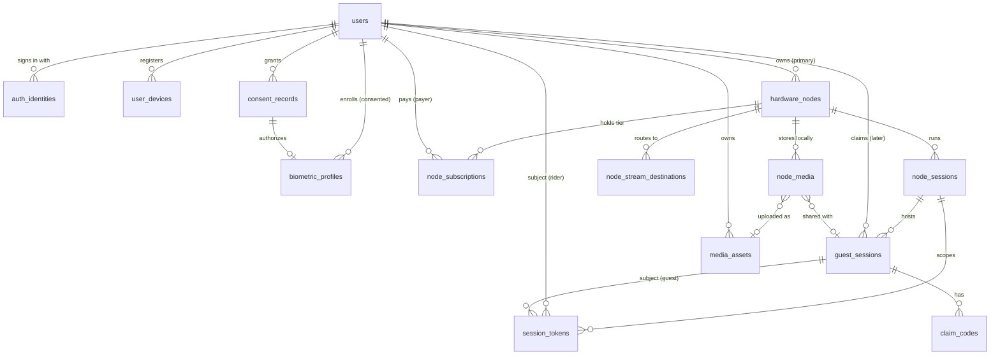

# Decoupled Identity Architecture — Technical API Proposal (v2)

**Status: proposal only.** Nothing in this document is built, deployed, or
wired into the Flutter client. It is the contract for Binnacle Cloud, the
Vision unit (Jetson Orin Nano) software, and Connect to review and build
against.

**Supersedes:**
- v1 of this file (single email/password account API on Core, with biometric
  unlock).
- The interim "Core-issued per-boat member accounts" idea, rejected on
  2026-09-18 because a boat-siloed account stops a rider carrying their profile
  to other boats.

**Related issues:** BIN-46 (security/account linking/authorization), BIN-40
(Binnacle Live privacy/viewing), BIN-41 (cloud media/Library), BIN-48
(S3/CloudFront), BIN-43 (subscriptions/entitlements), BIN-39 (live uplink).

**Standing constraints carried into this design**
- No biometric *authentication*. Face/physique embeddings (section 8) are
  used for rider *recognition* by Spotter, never to sign a user in or unlock
  anything.
- No credentials, stream keys, or tokens in code, logs, screenshots, or
  evidence. All examples below use placeholders.
- Broadcast control stays separate from vessel control (BIN-46).

---

## 1. Model at a glance

Three separate concerns that the earlier design fused together:

| Concern | Entity | Lives in | Lifetime |
|---|---|---|---|
| **Who is the human** | Rider Account (`users`) | Binnacle Cloud | Permanent, global, follows the rider to any boat |
| **What is the boat gear** | Vision unit (`hardware_nodes`) | Cloud registry + the unit itself | Permanent, owned by one primary Rider Account |
| **Who may do what right now** | Session access (`session_tokens`) | Issued by the Vision unit, mirrored to Cloud | Ephemeral, tied to one ride session, not to the hardware |

```
  Rider Account (global)                    Vision unit (host)
  ┌───────────────────────┐                ┌────────────────────────────┐
  │ OAuth identities      │                │ owner_user_id ─────────────┼─► Rider Account
  │ media library (cloud) │                │ subscription tier          │
  │ billing state (payer) │                │ NVMe storage registry      │
  │ Spotter embeddings*   │                │ stream routing (server-    │
  └──────────┬────────────┘                │   side secret refs)        │
             │ cached Rider Identity       └─────────────┬──────────────┘
             │ Assertion (JWT, offline)                  │
             ▼                                           │ local Wi-Fi
       Phone (Connect) ── mDNS / QR handshake ───────────┘
             ▲                                           │
             └────── Crew Session Token (temporary) ◄────┘
       Guest (no app) ── captive portal ─► Guest Session ID + Claim Code
```
\* Only with separate, explicit biometric consent (section 8).

---

## 2. Entities and database schema

PostgreSQL in Binnacle Cloud is the system of record. The Vision unit keeps a
local replica (SQLite) of the tables it needs to operate offline; the
replication rules are in section 4.7.

### 2.1 Relationships



### 2.2 DDL (Postgres; abridged to what the relationships need)

```sql
-- ── Rider Account (the User) ───────────────────────────────────────────
CREATE TABLE users (
  user_id        UUID PRIMARY KEY DEFAULT gen_random_uuid(),
  display_name   TEXT NOT NULL,
  primary_email  CITEXT,                       -- nullable: Apple private relay may hide it
  status         TEXT NOT NULL DEFAULT 'active'
                 CHECK (status IN ('active','suspended','pending_deletion')),
  birth_year     SMALLINT,                     -- age gating; see open decisions
  billing_ref    TEXT,                         -- opaque payment-processor customer id (payer state)
  created_at     TIMESTAMPTZ NOT NULL DEFAULT now(),
  deleted_at     TIMESTAMPTZ
);

CREATE TABLE auth_identities (
  identity_id       UUID PRIMARY KEY DEFAULT gen_random_uuid(),
  user_id           UUID NOT NULL REFERENCES users ON DELETE CASCADE,
  provider          TEXT NOT NULL CHECK (provider IN ('apple','google','email_otp')),
  provider_subject  TEXT NOT NULL,             -- OIDC `sub`, or normalized email for email_otp
  email             CITEXT,
  email_verified    BOOLEAN NOT NULL DEFAULT false,
  created_at        TIMESTAMPTZ NOT NULL DEFAULT now(),
  UNIQUE (provider, provider_subject)
);

-- A phone's non-exportable key; used for proof-of-possession (section 4).
CREATE TABLE user_devices (
  device_id     UUID PRIMARY KEY DEFAULT gen_random_uuid(),
  user_id       UUID NOT NULL REFERENCES users ON DELETE CASCADE,
  jwk_thumbprint TEXT NOT NULL UNIQUE,         -- RFC 7638 SHA-256 thumbprint of the public key
  public_jwk    JSONB NOT NULL,
  platform      TEXT NOT NULL,                 -- 'android' | 'ios'
  registered_at TIMESTAMPTZ NOT NULL DEFAULT now(),
  revoked_at    TIMESTAMPTZ
);

-- ── Vision hardware entity (the Host) ──────────────────────────────────
CREATE TABLE hardware_nodes (
  node_id          UUID PRIMARY KEY DEFAULT gen_random_uuid(),
  owner_user_id    UUID NOT NULL REFERENCES users,      -- primary owner
  serial           TEXT NOT NULL UNIQUE,
  model            TEXT NOT NULL DEFAULT 'vision-orin-nano',
  display_name     TEXT,                                -- NOT broadcast over mDNS
  node_public_jwk  JSONB NOT NULL,                      -- private key never leaves the unit
  node_key_id      TEXT NOT NULL,                       -- kid used in Crew Session Tokens
  join_policy      TEXT NOT NULL DEFAULT 'approve'
                   CHECK (join_policy IN ('approve','known_crew','open_to_riders')),
  status           TEXT NOT NULL DEFAULT 'active'
                   CHECK (status IN ('active','transferred','decommissioned')),
  claimed_at       TIMESTAMPTZ NOT NULL DEFAULT now(),
  last_seen_at     TIMESTAMPTZ
);

-- Tier lives on the node; the payer is a Rider Account (reconciles rules 1 and 2).
CREATE TABLE node_subscriptions (
  subscription_id  UUID PRIMARY KEY DEFAULT gen_random_uuid(),
  node_id          UUID NOT NULL REFERENCES hardware_nodes,
  payer_user_id    UUID NOT NULL REFERENCES users,
  tier             TEXT NOT NULL CHECK (tier IN ('free','ride','creator','creator_plus')),
  source           TEXT NOT NULL CHECK (source IN ('purchase_trial','paid','comp')),
  starts_at        TIMESTAMPTZ NOT NULL,
  ends_at          TIMESTAMPTZ,
  UNIQUE (node_id) DEFERRABLE INITIALLY DEFERRED   -- one active row; history kept in audit_log
);

-- Provider keys are never stored here: only a pointer into the cloud secret store.
CREATE TABLE node_stream_destinations (
  destination_id UUID PRIMARY KEY DEFAULT gen_random_uuid(),
  node_id        UUID NOT NULL REFERENCES hardware_nodes ON DELETE CASCADE,
  provider       TEXT NOT NULL,                -- youtube|facebook|twitch|custom_rtmp|binnacle_live
  label          TEXT NOT NULL,
  secret_ref     TEXT NOT NULL,                -- e.g. secrets-manager ARN; never returned by any API
  status         TEXT NOT NULL DEFAULT 'active',
  created_at     TIMESTAMPTZ NOT NULL DEFAULT now()
);

-- ── Ride session, tokens, guests ───────────────────────────────────────
CREATE TABLE node_sessions (
  node_session_id UUID PRIMARY KEY,            -- generated by the unit (works offline)
  node_id         UUID NOT NULL REFERENCES hardware_nodes,
  started_by      UUID REFERENCES users,
  started_at      TIMESTAMPTZ NOT NULL,
  ended_at        TIMESTAMPTZ,
  synced_at       TIMESTAMPTZ
);

CREATE TABLE guest_sessions (
  guest_session_id UUID PRIMARY KEY,           -- 128-bit random, generated by the unit
  node_id          UUID NOT NULL REFERENCES hardware_nodes,
  node_session_id  UUID NOT NULL REFERENCES node_sessions,
  created_at       TIMESTAMPTZ NOT NULL,
  expires_at       TIMESTAMPTZ NOT NULL,       -- access window, e.g. session end + 24 h
  claimed_by       UUID REFERENCES users,
  claimed_at       TIMESTAMPTZ
);

CREATE TABLE session_tokens (
  token_id        UUID PRIMARY KEY,            -- the JWT `jti`
  node_session_id UUID NOT NULL REFERENCES node_sessions,
  node_id         UUID NOT NULL REFERENCES hardware_nodes,
  subject_type    TEXT NOT NULL CHECK (subject_type IN ('user','guest')),
  user_id         UUID REFERENCES users,
  guest_session_id UUID REFERENCES guest_sessions,
  role            TEXT NOT NULL CHECK (role IN ('host','crew','guest')),
  scopes          TEXT[] NOT NULL,
  device_thumbprint TEXT,                      -- `cnf.jkt` binding; NULL for portal guests
  join_method     TEXT NOT NULL CHECK (join_method IN ('mdns','qr','portal')),
  issued_at       TIMESTAMPTZ NOT NULL,
  expires_at      TIMESTAMPTZ NOT NULL,
  revoked_at      TIMESTAMPTZ,
  revoked_reason  TEXT,
  CHECK ((subject_type='user'  AND user_id IS NOT NULL AND guest_session_id IS NULL) OR
         (subject_type='guest' AND guest_session_id IS NOT NULL AND user_id IS NULL))
);
CREATE INDEX ON session_tokens (node_id, expires_at);

CREATE TABLE claim_codes (
  claim_id         UUID PRIMARY KEY DEFAULT gen_random_uuid(),
  guest_session_id UUID NOT NULL REFERENCES guest_sessions,
  code_hash        BYTEA NOT NULL UNIQUE,      -- HMAC-SHA256(server_pepper, code); plaintext never stored
  expires_at       TIMESTAMPTZ NOT NULL,
  failed_attempts  SMALLINT NOT NULL DEFAULT 0,
  redeemed_at      TIMESTAMPTZ
);

-- ── Media ──────────────────────────────────────────────────────────────
-- The rider's cloud library (BIN-41/48); objects are private S3 keys.
CREATE TABLE media_assets (
  media_asset_id   UUID PRIMARY KEY DEFAULT gen_random_uuid(),
  owner_user_id    UUID NOT NULL REFERENCES users,
  source_node_id   UUID REFERENCES hardware_nodes,
  sha256           BYTEA NOT NULL,             -- verified against the stored object
  object_key       TEXT NOT NULL,
  created_at       TIMESTAMPTZ NOT NULL DEFAULT now()
);

-- The unit's local NVMe registry (replicated to Cloud when online).
CREATE TABLE node_media (
  local_media_id   UUID PRIMARY KEY,
  node_id          UUID NOT NULL REFERENCES hardware_nodes,
  node_session_id  UUID NOT NULL REFERENCES node_sessions,
  sha256           BYTEA NOT NULL,
  size_bytes       BIGINT NOT NULL,
  kind             TEXT NOT NULL,              -- original | highlight | derivative
  shared_guest_session_id UUID REFERENCES guest_sessions,  -- set by the host, never inferred
  assigned_user_id UUID REFERENCES users,      -- set by the host or a consented recognition confirm
  media_asset_id   UUID REFERENCES media_assets,           -- non-NULL only after verified upload
  created_at       TIMESTAMPTZ NOT NULL
);

-- ── Consent and biometrics (section 8) ─────────────────────────────────
CREATE TABLE consent_records (
  consent_id     UUID PRIMARY KEY DEFAULT gen_random_uuid(),
  user_id        UUID NOT NULL REFERENCES users ON DELETE CASCADE,
  kind           TEXT NOT NULL,                -- 'biometric_recognition' | 'terms' | 'privacy' | ...
  policy_version TEXT NOT NULL,
  jurisdiction   TEXT,
  granted_at     TIMESTAMPTZ NOT NULL,
  revoked_at     TIMESTAMPTZ
);

CREATE TABLE biometric_profiles (
  profile_id     UUID PRIMARY KEY DEFAULT gen_random_uuid(),
  user_id        UUID NOT NULL REFERENCES users ON DELETE CASCADE,
  consent_id     UUID NOT NULL REFERENCES consent_records,   -- no consent row, no profile
  model_version  TEXT NOT NULL,
  embedding_enc  BYTEA NOT NULL,               -- envelope-encrypted; separate KMS key + IAM role
  created_at     TIMESTAMPTZ NOT NULL DEFAULT now(),
  destroy_by     TIMESTAMPTZ NOT NULL,         -- retention schedule enforced by a job
  destroyed_at   TIMESTAMPTZ
);

CREATE TABLE audit_log (
  audit_id   BIGSERIAL PRIMARY KEY,
  at         TIMESTAMPTZ NOT NULL DEFAULT now(),
  actor_type TEXT NOT NULL, actor_id TEXT,
  action     TEXT NOT NULL, subject TEXT,
  detail     JSONB                             -- tokens/keys are redacted before insert
);
```

### 2.3 Rules the schema encodes

- A user can exist with no node, and a node always has exactly one primary
  owner. Riders travelling to another boat need no relationship to that boat.
- `session_tokens` binds a subject to a `node_session_id`, not to a node
  forever. When the session ends, every token for it is revoked.
- **Tier vs billing.** Rule 1 puts billing state on the Rider Account; rule 2
  puts the active tier on the Vision unit. Both hold: the *payer* is a user
  (`node_subscriptions.payer_user_id`, `users.billing_ref`), the *entitlement*
  attaches to the node. Ownership transfer of a node re-points the
  subscription only if the payer agrees.
- `media_assets.owner_user_id` is the rider; `source_node_id` is provenance.
  A guest's media reaches an account only through a claim (section 6).
- `node_media.media_asset_id` is non-NULL only after a checksum-verified
  upload, which is what lets Connect honestly label media "backed up".

---

## 3. Token types

| Token | Issuer | Verified by | Purpose | Default lifetime |
|---|---|---|---|---|
| **Access token** | Cloud | Cloud APIs | Call Cloud APIs | 15 min, refreshable |
| **Refresh token** | Cloud | Cloud | Renew the two below | 60 days, rotating, revocable |
| **Rider Identity Assertion (RIA)** | Cloud, ES256 | **The Vision unit, offline** | Prove "I am Rider X" without cellular | **14 days** (owner decision; section 11) |
| **Crew Session Token (CST)** | **The Vision unit**, ES256 | The Vision unit | Temporary role for one ride session | Session length, hard cap 12 h |
| **Guest Session ID** | The Vision unit | The Vision unit | Identify a captive-portal guest | Session end + 24 h |
| **Claim Code** | The Vision unit | Node or Cloud | Later merge guest clips into an account | 30 days (owner decision) |

### 3.1 Rider Identity Assertion (the "locally cached JWT")

```
header: { "alg":"ES256", "kid":"<cloud signing key id>", "typ":"binnacle-ria+jwt" }
claims: {
  "iss":"https://id.binnacle.example",   "aud":"binnacle-vision",
  "sub":"user:<user_id>",                "name":"<display_name>",
  "iat":..., "nbf":..., "exp":...,       "jti":"<uuid>",
  "cnf":{ "jkt":"<phone key thumbprint>" },   // RFC 7800 / 7638 binding
  "ver":1
}
```
- Bound to the phone's non-exportable key (`cnf.jkt`). A copied token is
  useless without that key, which matters because the token must be usable
  offline for days.
- No tier, email, or embeddings in the token. Entitlements come from the
  node's own subscription record.
- Refreshed silently whenever the phone has internet. If it lapses while
  offline, the phone can still join as a **guest** (section 6), and will show
  "Sign-in expired — connect to the internet once to restore your profile".

---

## 4. Ephemeral session access: the offline handshake

### 4.1 Roles and scopes (RBAC tied to the session)

| Scope | host | crew | guest |
|---|:-:|:-:|:-:|
| `session.view` (live view, session status) | ✔ | ✔ | ✔ (view-only) |
| `highlight.trigger` (save highlight) | ✔ | ✔ | – |
| `library.read_session` (session clips) | ✔ | ✔ | shared clips only |
| `library.read_own` (clips assigned to me) | ✔ | ✔ | – |
| `broadcast.select_destination` | ✔ | optional per host | – |
| `broadcast.control` (start/stop) | ✔ | optional per host | – |
| `node.settings.write`, `node.manage_join_policy` | owner only | – | – |
| `session.end`, `token.revoke` | ✔ | – | – |
| `stream.read_key` | **nobody** | | |
| vessel/boat control | out of scope (separate control plane) | | |

`host` is granted automatically to the Rider Account equal to
`hardware_nodes.owner_user_id`, or by the owner delegating for that session.
Nothing a `crew` token can do persists after the session, and no scope
returns a stream key.

### 4.2 Two ways to start the handshake

| Mode | Discovery | Trust anchor | Use when |
|---|---|---|---|
| **A: dynamic QR (strongest)** | Host's screen (Spotter display or host phone) shows a QR that rotates every 60 s | QR carries the node key fingerprint + a one-time join nonce, so the joining phone pins the node and proves physical presence | Default for a new crew member |
| **B: mDNS + Wi-Fi passphrase** | Phone browses `_binnacle-vision._tcp.local.` on the boat's Wi-Fi | Wi-Fi passphrase (physical-presence proxy) + trust-on-first-use of the node key + host approval | Returning crew, convenience |

mDNS is unauthenticated multicast and can be spoofed, so it is used only for
discovery. Identity and trust come from the node key and the exchange below.

### 4.3 mDNS advertisement

```
service:   _binnacle-vision._tcp.local.        port 8443
instance:  Vision-<4 hex>                       (no serial, no boat name)
TXT:       v=1
           nid=<first 8 bytes of node_id, hex>
           fp=<first 8 bytes of SHA-256(node public key), hex>
           open=1|0                             (a ride session is open)
           cap=<capability flags>
```
No user, boat, or location data in TXT records. Platform notes: Android needs
`CHANGE_WIFI_MULTICAST_STATE` (multicast lock) or `NsdManager`; iOS needs
`NSLocalNetworkUsageDescription` and `NSBonjourServices` and shows a Local
Network permission prompt.

### 4.4 Handshake (no cellular required)

Preconditions: phone holds a valid RIA, its device key, and (Mode B) the boat
Wi-Fi passphrase. The unit holds a cached copy of Cloud's signing keys
(JWKS), a local revocation list, and its own node key.

```
Phone                                         Vision unit
  │  1. mDNS browse / scan QR                    │
  │ ◄──────── nid, fp, open ─────────────────────│
  │  2. TLS 1.3 to https://<host>:8443           │  (self-signed cert)
  │     check SHA-256(cert public key) == fp     │  → mismatch: abort, warn "unrecognised device"
  │                                              │
  │  3. POST /v1/join/hello                      │
  │     { client_nonce, device_public_jwk,       │
  │       join_nonce? (Mode A) }                 │
  │ ◄──── { node_nonce, node_id, node_time } ────│
  │                                              │
  │  4. POST /v1/join/prove                      │
  │     { ria,                                   │
  │       pop: JWS_device_key(                   │
  │         node_nonce, client_nonce, node_id,   │
  │         TLS-exporter(RFC 8446 §7.5)) }       │  ← channel binding defeats relay/replay
  │                                              │
  │              5. verify: ria signature (cached JWKS by kid), iss, aud,
  │                 nbf/exp (±5 min skew), jti ∉ revocation list,
  │                 cnf.jkt == thumbprint(device_public_jwk), pop signature,
  │                 nonces fresh and single-use, node clock sane (section 4.6),
  │                 user ∉ node ban list
  │              6. role: user_id == owner_user_id → host;
  │                 else per join_policy:
  │                   approve        → wait for host approval on host device/Spotter
  │                   known_crew     → allow if user_id ∈ node's allowlist
  │                   open_to_riders → allow any valid Rider Account
  │              7. mint CST (ES256, signed with the node key), record in local session_tokens
  │ ◄──── { cst, role, scopes, expires_at } ─────│
  │  8. WSS control channel: Authorization: CST + PoP per connection
```

CST claims:
```
{ "iss":"node:<node_id>", "sub":"user:<user_id>", "nsid":"<node_session_id>",
  "role":"crew", "scopes":[...], "cnf":{"jkt":"<phone key thumbprint>"},
  "iat":..., "exp":..., "jti":"<uuid>", "kid":"<node_key_id>" }
```

### 4.5 Renewal, end, and revocation

- `POST /v1/session/refresh` extends a CST in slices (e.g. 2 h) while the
  node session is open, never beyond the 12 h cap or the session end.
- `POST /v1/session/end` (host) closes the node session and revokes all its
  tokens. A node reboot does not end tokens; a factory reset does.
- The host can revoke a single crew member at any time. The revocation is
  applied locally at once and to Cloud when next online.
- Every token check reads the local `session_tokens` row, so revocation works
  offline.

### 4.6 Clock and freshness offline

The Jetson may have no trustworthy time offline. The unit therefore keeps a
monotonic "last-known-good time" (GPS time when available, otherwise
Cloud-synced), and **refuses** to validate expiry if its clock is earlier than
that value (rollback). The phone's `node_time` exchange is advisory only.
Failure mode: rejects with `clock_untrusted`, and the host can reset time from
their authenticated phone.

### 4.7 Sync and what the unit caches

| Direction | Data | When |
|---|---|---|
| Cloud → unit | JWKS (with key overlap during rotation), revocation list (jti + disabled `user_id`s), subscription tier, destination metadata (never keys) | Whenever online; also signed bundle at manufacture |
| Unit → Cloud | `node_sessions`, `session_tokens` (incl. revocations), `guest_sessions`, `claim_codes` (hashes), `node_media` registry, audit events | Whenever online |

Accepted risk, stated plainly: an account disabled while a unit is offline
stays admitted until that unit syncs, bounded by the RIA lifetime (14 days
proposed) and the CST cap (12 h). Shorter RIA lifetimes trade this off against
offline usability.

### 4.8 Relationship to the existing device pairing

Today `PairingService` creates an EC keypair + CSR and binds a phone to one
boat's Core permanently, with a device credential in Keychain/Keystore. Under
this design:

- **Owner claim** replaces first pairing: on first setup the owner signs in,
  scans the unit's provisioning QR, and the unit registers with Cloud as a
  `hardware_nodes` row owned by that Rider Account (`POST /v1/nodes/claim`).
- **Crew access** uses the handshake above. Nothing permanent is stored about a
  crew member on the unit except the audit trail and (optional) allowlist.
- The existing pairing credential keeps working during a migration window, then
  is retired. This changes a security-critical existing protocol and needs
  Core-team review before any code.

---

## 5. Cloud API (for the Connect app and the unit)

Authentication: OAuth 2.0 for native apps (RFC 8252) with PKCE (RFC 7636).
Apple and Google via OIDC. "Email" is **passwordless email one-time code**
(there is no password to store or leak). If any third-party sign-in is
offered, current App Store rules require a privacy-preserving equivalent;
Sign in with Apple satisfies this. Verify the current guideline at build time.

### 5.1 Identity

| Method & path | Purpose |
|---|---|
| `POST /v1/auth/oauth/{apple\|google}/exchange` | `{id_token, code_verifier}` → access, refresh, RIA. Creates the account on first use. |
| `POST /v1/auth/email/start`, `POST /v1/auth/email/verify` | Passwordless email code flow. |
| `POST /v1/auth/refresh` | Rotate refresh token; returns new access token and RIA. |
| `POST /v1/auth/logout` | Revoke refresh token and the device's RIAs. |
| `POST /v1/users/me/identities` | Link another provider. Only after re-authentication; never auto-link on email match alone. |
| `DELETE /v1/users/me` | Account deletion (in-app path required by the app stores). Cascades: identities, devices, biometric profiles destroyed, media per retention policy; nodes must first be transferred or decommissioned. |
| `POST /v1/devices` | Register the phone's public key (proof-of-possession). |
| `GET /.well-known/jwks.json` | Public signing keys (units cache this). |

### 5.2 Nodes (owner-facing)

| Method & path | Purpose |
|---|---|
| `POST /v1/nodes/claim` | Owner binds a unit to their account using the provisioning code + the unit's signed statement. |
| `GET /v1/nodes`, `GET /v1/nodes/{id}` | Nodes the caller owns. |
| `PATCH /v1/nodes/{id}` | Name, `join_policy`, allowlist. |
| `POST /v1/nodes/{id}/transfer` | Two-step transfer; the unit rotates its node key and all session tokens are revoked. |
| `POST /v1/nodes/{id}/destinations` | Create a stream destination; the secret goes straight into the cloud secret store and is never returned. |
| `GET /v1/nodes/{id}/sync` | Unit-facing: JWKS, revocations, tier (authenticated with the node key). |

### 5.3 Unit-local API (over the boat Wi-Fi, section 4)

`/v1/join/hello`, `/v1/join/prove`, `/v1/session/refresh`,
`/v1/session/end`, `/v1/session/revoke`, `/v1/guest/portal` (HTTP),
`/v1/guest/claim-code`, `/v1/guest/clips`.

### 5.4 Media and entitlements

Media upload authorization, short-lived playback URLs, and retention follow
BIN-41/BIN-48/BIN-46 and use the Rider Account as the subject. See the open
question in section 11 on which account's tier governs storage.

---

## 6. Guest-to-Global pipeline

### 6.1 Guest joins without the app

1. Boat Wi-Fi's captive portal (DNS/HTTP redirect on the unit; the RFC 8908 /
   DHCP option 114 Captive Portal API where the phone OS supports it)
   presents a page: privacy notice, terms, "Continue as guest".
2. The unit creates a `guest_sessions` row: a 128-bit random
   `guest_session_id`, expiry = node session end + 24 h, and sets it in an
   HttpOnly cookie. Role `guest`, scopes: view-only + shared clips.
3. Guests see and download **only clips the host has shared with them**
   (`node_media.shared_guest_session_id`). Nothing is attributed to a guest
   automatically: no face/physique recognition is ever run on guests, and no
   embeddings are created for them.
4. The portal warns that in-OS captive-portal browsers often cannot download
   files and offers "Open in browser".

### 6.2 Claim Code

- Generated by the unit per guest session, shown **only** on that guest's own
  portal page (never on the Spotter display or shared screens).
- Format: 10 characters, Crockford Base32, displayed `XXXXX-XXXXX` (about 50
  bits). Stored only as `HMAC-SHA256(server_pepper, code)`.
- Single use, 30-day expiry (host-configurable 7–90 days).
- Rate limits: 5 failed attempts per code then locked; 10 per account per
  hour; generic error text.
- Every downloaded clip carries a manifest (`guest_session_id`, `sha256`) so
  the app can match local files to server records without re-uploading.

### 6.3 Redeeming (after the guest installs the app)

```
App (signed-in Rider Account)                      Cloud
  POST /v1/claims/redeem { claim_code }
                                                   look up code_hash; check expiry/attempts;
                                                   if the unit has not synced yet → 202 "pending, retry"
  ◄── { guest_session_id, clips:[{sha256,size,...}] }
  App compares sha256 with files already on the phone:
    – matches are linked, not duplicated
    – missing ones are offered for download/import
  Cloud: guest_sessions.claimed_by = user, media rights recorded;
         media reaches the library only after checksum-verified upload.
```
If the phone is on that boat's Wi-Fi it may also redeem directly against the
unit (`/v1/guest/claim-code`), which works with no Cloud reachability.

Legal/product point, not decided here: a clip on the host's NVMe can contain
several people. Claiming gives the guest a copy or licence for that guest's
shared clips; the host keeps their own. See section 11.

---

## 7. Stream routing and secrets (BIN-46 alignment)

- Provider keys and OAuth tokens live only in the cloud secret store,
  referenced by `node_stream_destinations.secret_ref`.
- When a broadcast starts, the unit requests a short-lived, scoped ingest
  credential from Cloud (or Cloudflare Stream live input). Phones never
  receive stream keys; crew can pick a destination by label but cannot read
  the secret.
- The current Connect behaviour (custom RTMP entered on the phone, kept only
  in memory) would migrate to `POST /v1/nodes/{id}/destinations`.
- Logs, audit rows, and evidence redact tokens, keys, and sensitive URLs.

---

## 8. Spotter embeddings: biometric data requirements

Rule 1 places facial/physique embeddings on the Rider Account. These are
biometric identifiers under laws such as Illinois BIPA, Texas CUBI, GDPR
Art. 9 (special-category data), and state privacy statutes. The design
therefore treats them as a separate, opt-in feature, not part of account
creation.

1. **Separate explicit consent.** No account-creation or OAuth step may
   create an embedding. A `consent_records` row of kind
   `biometric_recognition`, with policy version and jurisdiction, is a hard
   foreign-key prerequisite for any `biometric_profiles` row. Consent is
   revocable at any time.
2. **Recognition, not authentication.** Embeddings are never used to sign in,
   unlock, or authorize anything.
3. **Only enrolled, consenting riders.** No embeddings for guests, bystanders,
   or anyone who has not enrolled. Spotter cannot attribute clips to
   non-enrolled people.
4. **Per-ride opt-in to the boat.** An embedding reaches a Vision unit only
   if the rider allows "this boat may recognise me for this ride" at
   handshake. It is held encrypted in the unit's memory/session store and
   purged at session end. Unit owners cannot read or export it.
5. **Storage and access.** Envelope-encrypted with a dedicated KMS key and
   IAM role, separate from the media and account stores; every access is
   audited.
6. **Retention and deletion.** A written retention/destruction schedule
   (`destroy_by`) enforced by a job; deletion on request and on account
   deletion, with a deadline set by counsel.
7. **Minors.** Enrolment blocked below a minimum age (open decision);
   parental consent flow if the minimum is below the age of digital consent.
8. **Recognition is a suggestion.** A recognition hit proposes a rider for a
   clip; assignment to the account requires the rider's or host's
   confirmation.
9. **Legal review before any build.** This section is a requirements list, not
   legal advice. The repo already carries `Rider.biometricConsent` and a
   BIPA-scoped consent reference; those must be reconciled with this design.

---

## 9. Threats and mitigations

| Threat | Mitigation |
|---|---|
| Stolen phone / copied RIA replayed | RIA and CST bound to the phone's non-exportable key (`cnf.jkt`) with proof-of-possession on every use |
| Evil-twin Wi-Fi or rogue "Vision" | TLS key pinned via QR fingerprint (Mode A) or TOFU + host approval (Mode B); fingerprint mismatch aborts |
| Relay of a handshake | TLS-exporter channel binding, single-use nonces, 30 s validity |
| mDNS spoofing / snooping | mDNS used for discovery only; TXT holds no identifiers beyond an 8-byte node prefix |
| Revoked user still admitted offline | Bounded by RIA lifetime and CST cap; local revocation list; documented trade-off |
| Clock rollback to extend tokens | Monotonic last-known-good time; reject on regression |
| Claim-code brute force / shoulder surfing | ~50-bit code, hashed, rate-limited, single use, shown only on the guest's own session |
| Account takeover via email collision | No auto-link on matching email; re-auth required to link identities |
| Malicious crew abusing scopes | Least-privilege scopes; no scope reads keys; host can revoke instantly |
| Node theft / resale | Owner-initiated transfer rotates node key and revokes all tokens; decommission wipes registry |
| Secrets in logs | Redaction before audit insert; CI static check for key/token patterns (existing audit) |
| Local-network exposure | Node API listens only on the boat network interface; TLS 1.3 only; rate-limited |

---

## 10. Connect (Flutter) impact

| Piece | Change |
|---|---|
| Sign-in | Native Apple/Google/email-code sign-in; RIA in secure storage; device key in Keystore/Secure Enclave (no `local_auth`) |
| Connection | Replace the permanent-pairing screen with Join Boat (QR or nearby boats via mDNS); `PairingService` kept behind a compatibility flag during migration |
| Session state | New `CrewSession` (CST, role, scopes) driving what each screen shows; UI gates are convenience, the unit enforces |
| Library | Media owned by the Rider Account; guest claim flow; "backed up" only after verified upload (already the rule) |
| Storage screen | Unchanged rule: never labels media remote without a confirmed object |
| Removed | The v1 "biometric unlock of a stored session" idea |

None of this is implemented in this change.

---

## 11. Decisions needed from the owner

1. **Auth provider:** build vs buy (managed identity service versus own OIDC
   verification + token service). Affects cost and effort, not the API shape.
2. **RIA offline lifetime:** 14 days proposed. Longer = better offline, worse
   revocation lag.
3. **Default `join_policy`:** `approve` proposed for new units.
4. **Which tier governs a rider's library retention/storage** when they ride
   on someone else's boat: the rider's own account, or the host's node?
   Proposed: capture, live, and fan-out follow the **node's** tier; library
   retention follows the **rider's own** subscription.
5. **Clip ownership among host, rider, guests and others in frame.**
6. **Minimum age** for accounts and for biometric enrolment.
7. **Claim Code lifetime** (30 days proposed).
8. **Whether embeddings ever leave the phone/cloud for a unit** (section 8.4
   proposes opt-in per ride, in-memory only).
9. **Legal review** of section 8 before any biometric work begins.

---

## 12. Delivery plan and proving tests

| Phase | Deliverable | Proving test |
|---|---|---|
| 0 | Owner decisions in section 11; Core-team review of section 4.8 | Written sign-off |
| 1 | Cloud identity: OAuth/email exchange, `users`, devices, JWKS, refresh, delete account | Two providers create one account with no duplicate; deleted account cannot sign in; tokens redacted in logs |
| 2 | Node claim, node keypair, Cloud sync, `hardware_nodes`, subscriptions | A unit registered to owner A; transfer to B rotates its key and revokes A's tokens |
| 3 | Offline handshake and CST | With **cellular disabled on both sides**: a rider from a different account joins as crew; replay of a captured handshake fails; a revoked rider is rejected after sync; a rolled-back clock is refused; a token stolen to another phone fails PoP |
| 4 | Guest portal and Claim Code | A guest with no app downloads a host-shared clip; later signs up, redeems the code, and the clip matches by checksum with no duplicate; 6th wrong guess locks the code |
| 5 | Media ownership and entitlement lookup (with BIN-41/48/43) | Unauthorized playback blocked; uploaded object hash equals local hash before "backed up" |
| 6 | Biometric enrolment (after legal review) | Enrollment impossible without a consent row; revocation destroys the embedding within the stated deadline; guests never get embeddings |

Nothing here is a claim that any phase exists today.
